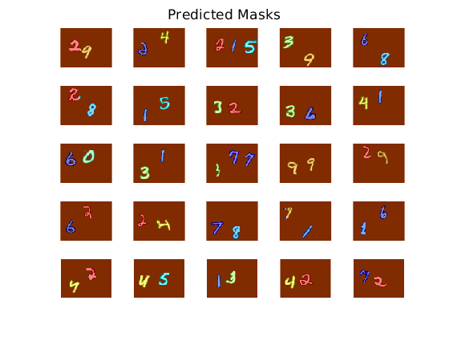

## Data Generation 

To generate M2NIST data one can use the utility [generate_M2NIST.py](generate_M2NIST.py)

## Required Packages

- Keras
- OpenCV
- Sklearn

With the above packages installed, the utility can be used as follows: 

``` 
usage: generate_M2NIST.py [-h] [-n NUM_IMAGES] [-d DIGITS_PER_IMAGE] -i,
                          IMG_DIR -m MASK_DIR

optional arguments:
  -h, --help            show this help message and exit
  -n NUM_IMAGES, --num_images NUM_IMAGES
                        number of training images to generate
  -d DIGITS_PER_IMAGE, --digits_per_image DIGITS_PER_IMAGE
                        how many images to put into the output image
  -i, IMG_DIR, --img_dir IMG_DIR
                        path to directory to store image files
  -m MASK_DIR, --mask_dir MASK_DIR
                        path to directory to store mask files
```

### Example:
``` 
python generate_M2NIST.py -n 5000 -d 3 -i images/ -m masks/ 
``` 

Once the predictions have been made you can visualize the segmentation predictions and obtain a plot such as the following:



The above plot was produced by the network file [net_75iou.mat](./models/net_75iou.mat).


